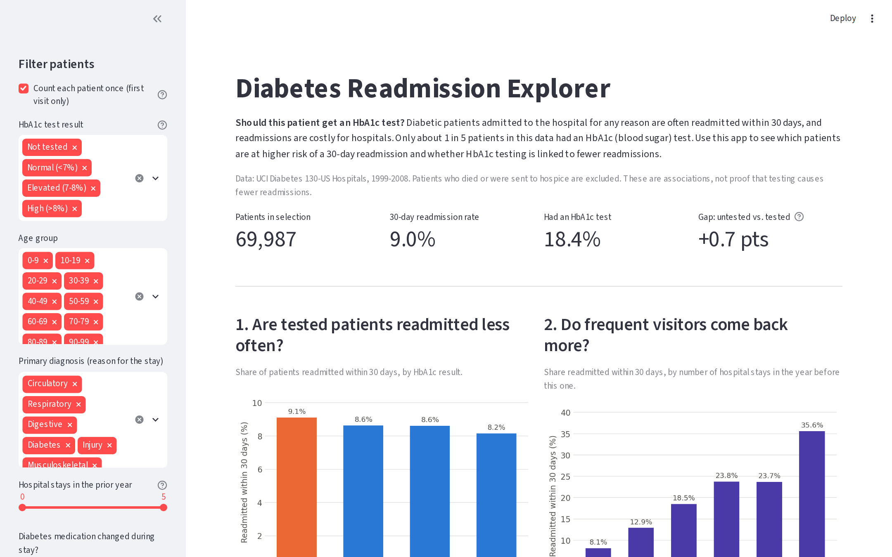
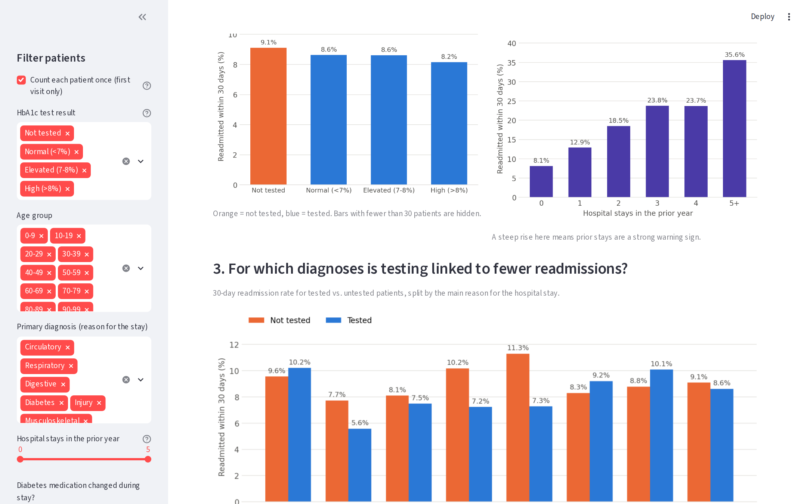
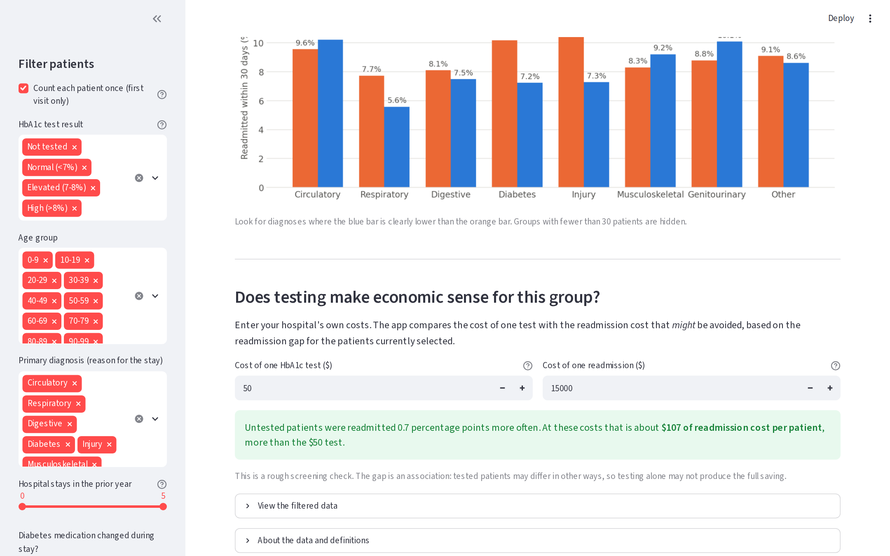
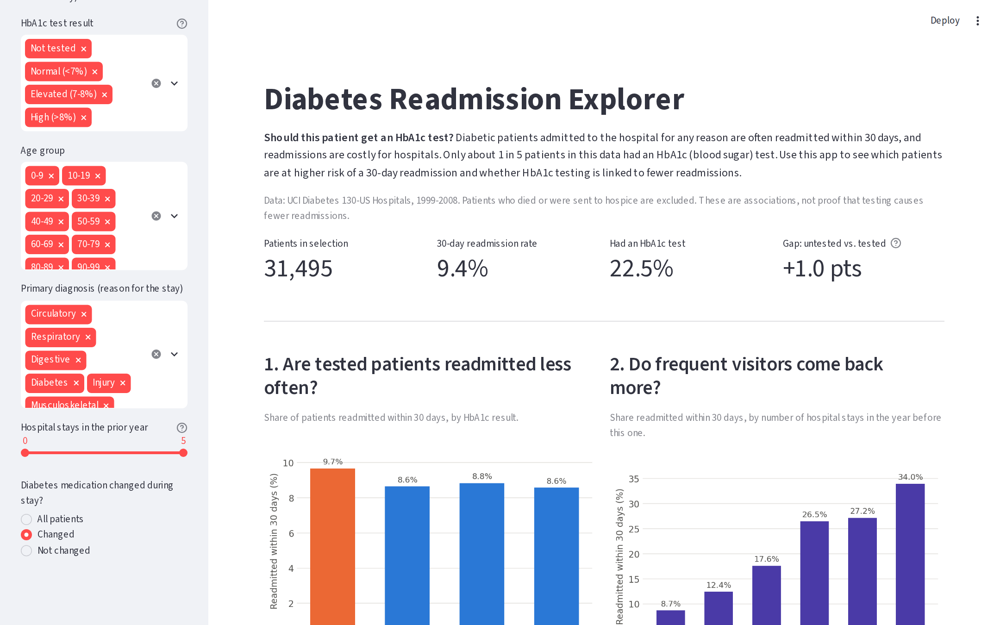

# Diabetes Readmission Explorer

An interactive Streamlit app that helps hospital staff decide which diabetic
patients are at high risk of being readmitted within 30 days, and whether
ordering an HbA1c (blood sugar) test makes sense for them.

BAN 601 - Project 1

## Business problem

Diabetic patients admitted to the hospital for any reason are often readmitted
within 30 days, and readmissions are expensive for hospitals. Yet only about
18% of patients in this data received an HbA1c test during their stay. In the
data, tested patients were readmitted somewhat less often (a correlation, not
proof that testing causes the difference).

**Who uses the app:** the clinician who first takes the patient's case, such
as an internal medicine doctor, cardiologist, surgeon, general practitioner,
primary care physician, or endocrinologist.

**Questions the app answers:**

1. Are patients who get an HbA1c test readmitted less often than those who don't?
2. Do patients with more hospital stays in the prior year come back more often?
3. For which primary diagnoses is testing linked to the biggest drop in readmissions?
4. For a chosen group of patients, does the readmission gap justify the cost of the test?

## Dataset

**Diabetes 130-US Hospitals for Years 1999-2008**, UCI Machine Learning Repository
(CC BY 4.0): https://archive.ics.uci.edu/dataset/296/diabetes+130-us+hospitals+for+years+1999-2008

- 101,766 hospital stays of diabetic patients, 50 columns
- Numeric: time in hospital, lab procedures, procedures, diagnoses, prior
  outpatient / emergency / inpatient visits
- Categorical: race, gender, age group, diagnoses, HbA1c result, insulin,
  medication change, discharge type, readmission

`data/diabetic_data.csv` and `data/IDS_mapping.csv` are included in this repo.
If they are missing, download the zip from the link above and put both CSV
files in the `data/` folder.

### Cleaning steps (`data_prep.py`)

- Read `?` as missing, and keep the text `None` in `A1Cresult` (it means
  "test not performed", not missing data)
- Keep only the columns the team selected
- Remove stays that ended in death or hospice (discharge codes 11, 13, 14,
  19, 20, 21), since those patients cannot be readmitted
- Remove 3 rows with an invalid gender
- Target: `readmit_30` = 1 if `readmitted` is `<30`, otherwise 0
- Group `diag_1` ICD-9 codes into Circulatory, Respiratory, Digestive,
  Diabetes, Injury, Musculoskeletal, Genitourinary, and Other
- Optional (on by default in the app): keep only each patient's first stay so
  frequent visitors are not counted many times

## The app

**Controls (sidebar):** count each patient once (checkbox), HbA1c result,
age group, and primary diagnosis (multi-selects), hospital stays in the prior
year (slider), and medication change (radio buttons). Test and readmission
costs can be entered for the break-even check.

**Visualizations:**

1. 30-day readmission rate by HbA1c result
2. 30-day readmission rate by number of hospital stays in the prior year
3. Tested vs. untested readmission rate for each primary diagnosis

Plus key numbers at the top, a break-even check, and a filtered data table
you can download.

### What we found (first stay per patient, all filters open)

- 18.4% of patients had an HbA1c test.
- Untested patients: 9.1% readmitted within 30 days, vs. 8.2-8.6% for the
  tested groups.
- Prior hospital stays are the strongest warning sign: 8.1% readmitted with
  no prior stays, 35.6% with 5 or more.
- The testing gap is largest when the main diagnosis is Diabetes
  (10.2% vs. 7.2%), Injury (11.3% vs. 7.3%), or Respiratory (7.7% vs. 5.6%).
  For Circulatory, Genitourinary, and Musculoskeletal stays, tested patients
  were readmitted slightly *more* often.

## How to run

```bash
# 1. Clone the repo
git clone https://github.com/IsaacZalis/Diabetes.git
cd Diabetes

# 2. Install the libraries
pip install -r requirements.txt

# 3. Start the app
streamlit run app.py
```

The app opens at http://localhost:8501. To check the cleaning step on its own,
run `python data_prep.py`.

## Files

```
app.py            Streamlit app
data_prep.py      Loading, cleaning, and new columns
requirements.txt  Python libraries
data/             diabetic_data.csv and IDS_mapping.csv
screenshots/      Screenshots of the app
```

## Screenshots





